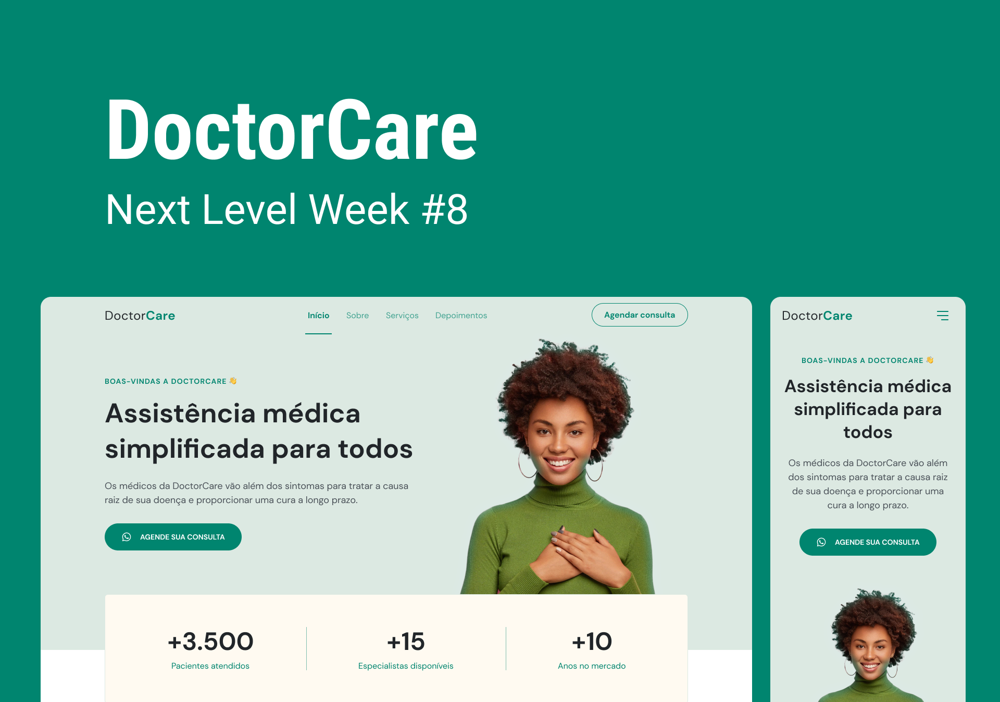

<h1 align="center"> # NLW Return - Origin  </h1>

This project was developed during Next Level Week Return (May 2-8, 2022), but I accessed this content in February 2025.

Throughout this series of lessons, I learned how to create a responsive One Page institutional website. The layout was originally designed for the DoctorCare medical consultation platform, but its flexible structure allows adaptations for different types of micro, small, and medium-sized businesses with simple design adjustments.

The Origin Mission of NLW#8 was designed for programming beginners, providing a solid introduction to the fundamentals of web development. During the project, I worked with HTML, CSS, and JavaScript, while also learning best practices and essential concepts.

  <a href="#-tecnologias">Technologies</a>&nbsp;&nbsp;&nbsp;|&nbsp;&nbsp;&nbsp;
  <a href="#-projeto">Project</a>&nbsp;&nbsp;&nbsp;|&nbsp;&nbsp;&nbsp;
  <a href="#-layout">Layout</a>&nbsp;&nbsp;&nbsp;|&nbsp;&nbsp;&nbsp;
  <a href="#memo-licença">License</a>

  

 

  

## 🚀 Technologies
This project was developed with the following technologies:
- HTML, CSS and JavaScript
- Git & GitHub
- Figma
- Responsively

## 💻 Project
This project is a responsive One Page institutional website designed for a medical appointment scheduling platform. During its development, I took on the challenge of optimizing navigation by implementing a dynamic responsive menu using JavaScript, ensuring a smoother and more accessible user experience.

- [Access the finished project](https://andreskull2.github.io/nlw-8-return-origin/)
- [Watch the classes](https://www.rocketseat.com.br/formacao/fullstack)

## 🔖 Layout
You can view the project layout through [LINK](https://www.figma.com/community/file/1102912263666619803). A Figma account is required to access it. [Figma](https://figma.com).

## :memo: License
This project is licensed under the MIT License.

---
Made with ♥ by Rocketseat :wave: [Join our community!](https://discord.gg/rocketseat)